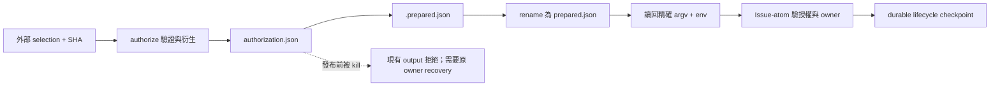

# Authorization publication 中斷後的重入邊界

## Overview

本報告檢查以下情況：`authorize` 已寫完 `authorization.json`，但程序在 `prepared.json` 發布前或後終止。fresh Session 只有原 selection SHA、output 與原 handoff。能否合法恢復，取決於留下的是已發布收據，還是尚未完成發布的授權 bytes。若原可信 output 中有完整 `prepared.json`，即使 stdout 未送達，也可讀回原 `next.argv`／`next.environment`。Issue-atom 再驗證這份 continuation，不必重跑 `authorize`。若只剩 `authorization.json`，還須確認 handoff 是否保存外部選定的 digest／continuation。若沒有，當時的 owner recovery 沒有可執行路徑能從 selection 身份恢復。這是待 fault controls 證明的「部分發布恢復能力缺口」，不是 output collision refusal 本身的 bug。

本報告只依靜態 source 分析。分析未啟動模型、Noodle daemon、provider mutation 或 fault process，也未修改 repository。讀取 source `/Users/neon/.codex/experiments/claim-refusal-closure-39lph64z/control-r02`，Git HEAD 已確認為 `51821b935424a4697e2534a9f15b068620510025`。採用指定 How explainer 格式。carrier 是當時平台的原生委派 agent，模型配置繼承 parent。上游方法的模型配置不適用。本報告不宣稱已取得不可觀測的 model ID 或推理設定。

## Key Concepts

- **selection commitment**：外部傳入 selection JSON 的 SHA-256。它固定顯式選擇，但不是 authorization JSON 的 digest。
- **authorization commitment**：producer 衍生 base、instruction digests、host config identity 後，對 canonical authorization bytes 算出的 digest。Issue-atom 要求外部 `SOODLES_AUTHORIZATION_SHA256` 與它匹配。
- **prepared publication**：`prepared.json` 是 producer 的完成收據，包含 final authorization path/digest、精確 argv 與環境。它不是 lifecycle checkpoint，也不授予 landing authority。
- **lifecycle checkpoint**：`authorization.json.state.json`，由 Issue-atom 擁有，綁 `authorization_sha256`；它出現在授權驗證之後。
- **unknown effect**：已持久記錄 offered、但 effect 結果未知。既有 owner 用 fresh readback 解決，不能因回應遺失就重做 effect。

## How It Works

### Owner / state / effect trace

| 步驟 | Owner、實際狀態 | 可見 effect 與 fresh Session 意義 |
| --- | --- | --- |
| 1 | `supervisor_admission.authorize` 驗 selection SHA、root、entry、全新外部 output（529–567） | output 已存在即拒絕；尚未建立新 output。這個 guard 不辨識「同一 producer 的殘留」。 |
| 2 | 讀 HEAD、committed instructions、host config；保留 carrier／publisher pins（568–602） | 衍生 authorization bytes/digest。selection 沒有直接攜帶 host config digest；不可假設日後重算必定相同。 |
| 3 | 寫臨時 authorization，呼叫 `issue_atom.validate_authorization`（603–606） | 確認 exact base、repo、carrier、外部 publisher、乾淨 tree；仍無 lifecycle/provider effect。 |
| 4 | 記憶體內組 final-path receipt，exclusive `mkdir`（607–619） | mkdir 是 output 佔有；它還不是可驗證的 selection→authorization durable commitment。競爭者目錄不能刪。 |
| 5 | `authorization.json.write_bytes`（621） | bytes 可能已完整寫入，但 producer 沒保存原 selection SHA 對這份衍生身份的持久綁定。 |
| 6 | 寫 `.prepared.json`，`os.replace` 發布 `prepared.json`（622–624） | 最終檔名是完成訊號。寫入沒有 file/directory fsync；原子 rename 不等於斷電持久性。 |
| 7 | return receipt，CLI JSON stdout（630、676–677） | stdout 遺失而 final receipt 尚在，屬可讀回完成結果。 |
| 8 | `issue_atom.run` 鎖 authorization；`_validate_authorization` 驗外部 digest（1006–1020、1291–1306） | 不讀 selection 或頂層 prepared，不負責判斷 producer 發布是否完成。 |
| 9 | 驗 Noodle owner、host profile、clean root、host config，再取得 supplier（1310–1344） | digest 缺失先拒絕；合法 continuation 仍可能因目前 capability/owner 狀態拒絕，不能把它誤判成 publication recovery 失敗。 |
| 10 | 建 checkpoint，effect 前持久保存 intent（1345 起） | `drive` 只觀察 pending，refusal 直接傳播；它沒有 admission recovery 或任意 retry 能力。 |

### 哪些情況目前能恢復

1. **發布後、stdout 前 SIGKILL**：final receipt 與 authorization 都完整留存時，可從原 handoff 指定的可信 output 讀回。仍需檢查 final paths、receipt digest／environment 一致性，再走原 continuation；更改 bytes 或外部 pins 應由既有 validator 拒絕。不要再 `authorize` 到同一目錄，也不要把「新的空目錄可成功」當作同一身份恢復。
2. **authorization 寫完、receipt 發布前 SIGKILL**：同 output 重入會在 565 行拒絕。`.prepared.json` 即便看似完整也是未發布暫存物，現有契約沒有授權 Session 自行 rename、補收據或把它提升為完成證據。若 handoff 原本保存了可信 authorization digest 與原 continuation，可用既有 Issue-atom 入口。若只有 selection digest，則不能把殘留檔案的即時計算 hash 自行當成外部授權。
3. **可捕捉的 publication exception**：`except BaseException` 刪除其 owned output（625–629）；現有 unit test 注入的是 `OSError`，驗證此清理。這不等於 SIGKILL：後者不執行 Python cleanup。一般「程序終止」太寬，評估必須指明 kill 類型與位置。
4. **authorization 原檔已遺失**：selected 身份不得重新授權替代。AGENTS 與 recipe 明確要求原 owner 回復 exact bytes。只有 selection SHA，甚至 selection 檔案也缺失時，缺的前提更多，不能聲稱可自行恢复。

### 兩個相似 durable checkpoint owner 的不變量

**Issue-atom owner** 使用 `save_json`（82–114）保存狀態。它先對暫存檔執行 write/flush/fsync，再執行 replace 與 directory fsync。`_run_owned` 在 `create_issue` 前先存 `writes.issue_create.status=offered`（1348–1359），再以 exact Issue marker readback 判斷結果。結果 unknown 時不重送。`bootstrap_noodle` 在 Noodle start 前持久記錄 offered（674–685）。只有 recorded `exited_zero` 才能完成後續恢復。snapshot 不能替代已遺失的 exit receipt（696–697）。這些 owner 都使用同一 command、durable identity 與 current readback。但它們的 effect 可能已執行，authorize 則尚未產生 lifecycle effect。

**Landing owner** 使用 `landing.save`（129–146）保存 checkpoint。`advance` 將合法候選變成 prepared intent（640–689）。`dispatch` 必須先改成 offered 並 fsync，再返回 request（692–725）。回應遺失後，owner 保留 offered evidence，後續只能 readback。若舊 schema 缺少 delivery，也按 offered 解讀，不能視為未送達（498–513）。Landing owner 可從 durable state 重新導出完成投影，但 authorization producer 尚無對應的 selected identity checkpoint。不能只為仿照 landing，就替沒有 provider effect 的 producer 新增 scheduler/retry engine。

### 最小 fault cases（待執行，不是既有通過證據）

| Case | 注入／輸入 | 必須觀察的 discriminator |
| --- | --- | --- |
| F1 | 正常 prepared；丟失 stdout | fresh consumer 從原 output 得相同 authorization bytes/digest/argv/env；零重新選擇。 |
| F2 | 實際 process kill：621 完成後、624 前；分別無 temp receipt、完整 temp receipt | 原 command 的 refusal、所有殘留 bytes、是否有合法 owner next。不得用 exception mock 取代 kill。 |
| F3 | 實際 process kill：624 後、stdout 前 | final receipt 可讀回；不重新 authorize、不改 output；consumer 可驗證（不需啟動 lifecycle effect）。 |
| F4 | 外來既存 output／同時 mkdir 競爭 | 必须拒絕且不覆寫、不移除 foreign residue；這個負例不能為恢復測試改成接受。 |
| F5 | F2/F3 後更改 selection bytes/SHA、authorization bytes、host config、publisher/carrier pins（各自獨立） | 不能重新衍生較新的身份並稱為恢復；合法 capability 修復與授權改選要分開記錄。 |
| F6 | 既有捕捉式 `os.replace` OSError | owned output 清理；與 F2 的 kill 殘留形成最近對照。 |

每例保存真正 subprocess argv、exit/signal、stdout/stderr、前後檔案清單與 digest。使用 disposable local fixture，將 provider/supplier/model 啟動設為禁止 effect；觀察 validator 或精確 continuation 即可，不以實際 Issue 開立證明恢復。F2 是缺口驗證，F4 是不能犧牲的 invariant。純靜態結果不足以宣稱 crash recovery 已被測實。

### 兩個可能的 owning boundaries

**A. 既有 `supervisor.authorization` producer 擁有身份保持的 materialization recovery（較直接）**。它已負責 selection 驗證與 authorization 衍生。可以在同一邊界加入可驗證的原 selection／derived bytes commitment，再依 durable state 回報或完成原 publication。如此，fresh Session 不需重建環境、digest 或 argv，Issue-atom 也能維持「只消費授權」的職責。但契約須清楚定義 commit point、partial/corrupt/foreign output、競爭 reservation 與舊 output compatibility。沒有 ownership proof 的舊殘留仍須拒絕。不能只刪掉 `not target.exists()`，也不能拿當下 host config 重新授權。這需要新測試支持的契約修正，不是現行權限。

**B. 保留 producer 為一次性發布，由既有 external supervisor／handoff owner 回復 exact bytes**。優點是 output collision guard 與現有 CLI 不變，不擴大 repo 內權限。supervisor 須在可中斷區之前保存足夠的原 authorization bytes/digest/continuation commitment。若傳入的 selection SHA/output/handoff 沒有這些內容，就不足以恢復。只寫「請 owner 恢復」不會產生可執行能力。恢復必須有實際 owner receipt 或受測的 recovery 實作，而且不能重新選擇 authority。

本報告不建議由 `issue_atom.drive` 負責恢復。它不持有 selection commitment。若允許它從未發布殘留自選 digest，就無法清楚區分授權 producer 與 effect consumer 的責任。若評估選 A，缺陷名稱應是「選定 authorization 的部分發布沒有身份保持的 owner continuation」，而不是「既存 output 被拒絕」。若需求只承諾 fail closed，並由外部 owner 人工恢復，當時的限制就是刻意設計。若需求承諾上述有限 handoff 足以讓 fresh-session 自動續接，F2 才構成可判定的 contract gap。

## Where Things Live

- `AGENTS.md`：初始 authorize／已選身份不得替代；完成後只消費 next。
- `contracts/system-v1.md:237–320`：authorization producer 與 lifecycle owner 的 authority／effect 邊界。
- `.agents/skills/verify-soodles/features/local-supervisor-admission.md:3–44`：new output、receipt last、準備無 lifecycle effect。
- `supervisor_admission.py:529–630`：唯一 authorize publication 實作。
- `issue_atom.py:157–240, 1291–1359, 1493–1509`：authorization digest、checkpoint、drive。
- `issue_atom.py:82–114, 627–731` 與 `landing.py:129–146, 640–725`：兩個 durable owner 範例。
- `tests/test_supervisor_authorization.py:44–73`：成功、捕捉式 publication failure、競爭 output。`tests/test_issue_atom.py` 的 unknown-create/start/bootstrap tests 及 `tests/test_landing.py:194` 的 crash readback test 提供既有不重送慣例。

## Gotchas

prepared receipt 沒有 selection SHA。它證明 producer 輸出的 continuation，但陌生 output 中的同名檔案不足以證明與原 selection 的關係。信任仍來自 supervisor 所保存的原 invocation／output custody。authorization validator 验 structural identity 与外部 digest，不驗「這個 digest 是從哪份 selection 合法衍生」。

本問題限定於 process kill。缺少 fsync 另有限制，即無法保證 power-loss 後的持久性。兩種 fault 需要分開的成功條件。另有一個邊界需要確認。`prepared.json` 已發布但 process 尚未結束時，可捕捉的中止仍可能執行 cleanup。選定的 owning boundary 須明確定義 receipt publication 與 return/cleanup 之間的 commit point。
