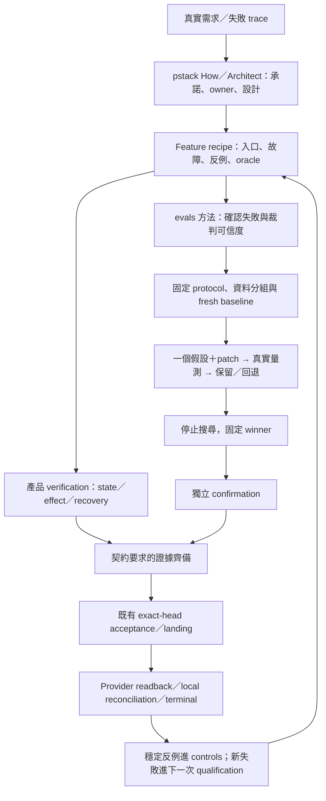

閉環實證\*\*，但要把驗證單位定成「一項 system design 承諾及其受影響因果鏈」。\*\* pstack 負責理解與比較設計；evals skills 負責量測可信度；真正證明承諾成立的，是 executable controls、實際行為證據，以及既有 owner 的交付結果。

\#191 已完成其中一條路徑：**Local Session 使用既有 CLI 的入口優化**。它沒有完成整個 Soodles system design 的全面驗證。

而且有一個關鍵修正：pstack Hillclimb 明確要求先重現目標症狀；不能重現，就先修 reproduction。#191 證明了探索操作減少，沒有 fresh 重現原本「要求人提供可推導 authorization」的錯誤，所以不能宣稱該錯誤已被消除。[固定版本的 Hillclimb 方法](/Users/neon/.codex/experiments/eval-loop-contract-lzwb_hq9/methods/poteto-mode/playbooks/hillclimb.md)

**責任與目錄應這樣連接。** 以下以已落地結構為基礎，不要求新增一套框架：
```perl
soodles/
├── AGENTS.md
│   └── Session 判斷角色、選既有入口
├── contracts/system-v1.md
│   └── ownership、transition、交付承諾
├── .agents/skills/verify-soodles/features/
│   ├── local-supervisor-admission.md
│   │   └── 實際準備／恢復的 verification recipe
│   └── pclass-context.md
│       └── eval 方法、隔離、hill climb、confirmation 規則
├── supervisor_admission.py / issue_atom.py / landing.py
│   └── 狀態判定、拒絕、current next、effects 的 executable owner
├── tests/
│   └── 產品 controls，以及固定證據的離線重播
└── docs/experiments/<atom>/
    ├── protocol.md / freeze.json / manifest.json
    ├── discovery/              真實失敗與量測缺陷
    ├── cases/                  來源、群組、selection／confirmation
    ├── evaluator/ / tools/     該實驗的裁判、controls、analysis
    ├── verification/           state／effect／handoff 證據
    ├── archives/               原始 capture，壓縮封存
    ├── rounds/                 hypothesis／patch／keep-or-revert
    ├── confirmation/           固定 winner 與獨立確認
    └── decision.json / results.md
```

Runtime 時，既有 host／owner 另外提供執行位置：

| 角色可取得的資料責任          |                                                   |                                      |
| ------------------- | ------------------------------------------------- | ------------------------------------ |
| Supervisor／observer | 固定 protocol、裁判、完整 run 身分、confirmation             | 檢查量測與判定                              |
| Optimizer           | source、train traces、允許的 selection 摘要              | 一個假設與 patch                          |
| Fresh consumer      | 中性任務、指定 source、必要 inputs                          | 實際操作                                 |
| Delivery owner      | exact candidate、required evidence、fresh readbacks | publication、landing、terminal receipt |

**封存目錄不是 runtime 權限設定。** 最終一起保存，不代表執行時可以一起讀。交付後才產生的 terminal receipt，可以由既有 owner 在 repository 外保存，再以引用與 digest 連回該 atom。

**資料流的核心，是兩條證據線匯入同一交付邊界。**
````css

````

其中：

- **局部閉環**：一個失敗原因，經修改、量測、回退／採納與 confirmation。
- **全局閉環**：沿著這個 atom 受影響的 producer、consumer、handoff、recovery、交付與清理逐段驗證，並留下下一個 Session 可使用的證據。
- 全局的範圍應由依賴與副作用決定。只改 root 路由，不必因此重跑所有 features；改共享 authorization 格式，就必須涵蓋受影響的讀取者與恢復流程。

你原來的逐項要求，現在對照如下：

| 項目已有還缺什麼／適用界線            |                                             |                                                                    |
| ------------------------ | ------------------------------------------- | ------------------------------------------------------------------ |
| R1 真實失敗 → owner → oracle | 歷史抱怨、三狀態映射、探索成本 baseline                    | **原始 authorization 誤判的 fresh reproduction**，或明確將目標限定為探索效率          |
| R2 eval 方法路由             | pinned 方法、eval-audit、code oracle 優先         | 不必把所有 skills 都跑一遍；語意需求出現時才需要人工標註與 judge 校準                         |
| R3 目錄與可重用資料流             | 完整封存、manifest、離線重播                          | 尚未驗證另一個 fresh supervisor 僅依保存的入口與 handoff，就能準備下一次 fresh experiment |
| R4 外部裁判與 controls        | 固定 bytes、31 controls                        | 本次範圍完成；新 failure mode 需要自己的鑑別案例                                    |
| R5 資料切分                  | optimizer 分組及獨立 confirmation                | Judge splits 本次不適用；少量 fixture 不支持生產分布泛化                            |
| R6 角色隔離                  | 真實私有檔拒讀 probes                              | 完整 OS／IPC 隔離未證明；只有需要更強主張時才補                                        |
| R7 實際執行與 telemetry       | 25 次 consumer capture、兩次 optimizer          | 精確後端模型版本及未暴露 telemetry 仍 unknown                                   |
| R8 有界 hill climb         | 兩個假設，回退／保留都有證據                              | 本次完成                                                               |
| R9 Winner 後 confirmation | 固定 winner 後一次確認                             | 本次完成；不能把已看過的 confirmation 繼續當未見資料                                  |
| R10 正確性與成本               | gates 先於成本；命令事件中位數降低 25%                    | **總 token、時間、人工介入及測試成本的取捨尚未證明**                                    |
| R11 受影響因果鏈               | bounded handoff、實際交付與恢復                     | 尚不能推廣成所有 Session／所有 feature 的閉環                                    |
| R12 裁判缺陷回流               | v01 結束、保留失敗、v02 fresh baseline              | 本次完成；未來仍須依變更觸發重新驗證                                                 |
| R13 單一 atom 交付           | #191／#192、465 tests、terminal reconciliation | 本次完成；新增工作不能回填成 #191 當時已證明                                          |

因此，下一個目標不應寫成「完成全部 system design」或「讓 Agent 永遠不猜錯」。建議寫成這個可驗收的承諾：

> **在指定 Local carrier、使用者已授權且必要選定 inputs 齊備時，fresh Session 能透過既有 owner 產生正確 prepared receipt，並讓下一個 fresh Session 依當前 owner 狀態續行；缺少已選定身分或能力時正確拒絕，未知寫入先 readback。在這些條件成立後，再降低完成合格任務的成本。**

驗收分四層設定：

1. **先證明問題存在。**\
   用忠於真實任務的中性 case 重現原始失敗。若 baseline 全部正確，就記錄「未重現」，不能把較少命令當成原始錯誤已修復。
2. **固定不可交換的 hard gates。**\
   身分不替換、未知寫入不重送、缺 capability 不猜憑證、舊證據不授權新 head、handoff 刷新目前 owner。指定案例任何一項失敗，候選就不採納。
3. **只選一個主要改善指標。**\
   修正錯誤時，先看完整任務的正確完成結果；優化效率時，可沿用命令事件中位數降低至少 20%。Token、時間、人工介入與測試耗時另外報告，不能混成一個不透明總分。原先「至少兩個假設、最多三輪、一次 confirmation」仍可保留。
4. **把驗證成本放進決策。**\
   每輪跑受影響 controls 與固定 behavior cases；最終 head 跑既有完整 acceptance。若要宣稱整體更省，還要用同一成本單位比較「優化與驗證投入」和「未來合格任務累積節省」，目前的 25% 不足以回答這件事。

： 全自動處理是否能行為不退化但決策障礙降低讓 Agent 不猜錯，決策成本與測試成本用固化最短路徑的方式平衡：找出全自動以上流程的缺陷並固化狀態機到CLI