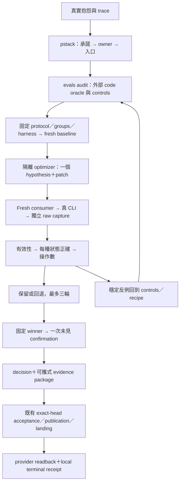

# Local Session：固定既有 CLI 入口的有界閉環

第二輪 P-class 候選通過 selection 和獨立 confirmation。兩次比較中，A 的 completed command 中位數都由 12 降為 9，減少 25%。三種狀態全部正確。這些觀察僅適用於所選 fixture 和 carrier，不能保證所有 Agent 永不退化，也沒有直接量測模型內部決策成本。

真實問題是使用者已授權地端工作，Session 卻要求人提供它能自行準備的 authorization 路徑和 SHA。Source review 發現，根入口漏了 pre-selection Local Session。既有 authorize 和 issue-atom owners 已能處理這些狀態。因此，本 atom 只修 AGENTS 路由與既有 CLI 呼叫形式，不改 CLI code，也不新增 eval engine。pstack How/Architect 用於找 owner 與承諾。Hillclimb 用於測試單一假設，再保留或回退。evals-start 導向 eval-audit，審查裁判與證據。verify-soodles recipe 保存可重跑路徑。

| 比較 | A baseline | A candidate | 中位數改善 | 三種狀態 | 決定 |
| --- | --- | --- | --- | --- | --- |
| r01：只增加 skill 入口 | 11、13、12 | 11、10、11 | 8.3% | 全 PASS | 回退 |
| r02：明示既有 CLI argv 與狀態界線 | 11、13、12 | 9、10、9 | 25% | 全 PASS | 固定 winner |
| 未見 confirmation | 12、12、12 | 9、9、9 | 25% | 全 PASS | 有界採納 |

固定規則要求至少兩個不同假設，最多三輪。先檢查正確性，再比較成本。A 中位數必須至少降低 20%，且至少兩次低於 baseline。已測兩輪，沒有為提高分數啟動第三輪。Winner 固定後，confirmation 只跑一次，沒有更換樣本。B/C 是 regression gates，不能用它們較低的操作數替代 A 的主指標。

## 承諾與既有 owner

| 狀態／承諾 | 真實 CLI 與 oracle | 此次證據 |
| --- | --- | --- |
| 授權尚未選定；Session 有完整選定 inputs | supervisor-admission authorize → prepared；確認產物、digest、next 原樣保存，沒有 lifecycle checkpoint | A selection 與 confirmation |
| 授權已選定但 exact file 遺失；不建立替代身分 | issue-atom run → authorization.path refusal；保留同身分 continuation | B；confirmation 保留先前 producer receipt |
| 授權可讀但 host capability 缺失；不猜憑證 | issue-atom run → provider_credential_profile.path；授權不變，僅允許既有 lock residue | C；XDG 與 HOME 路徑 |

Fresh confirmation consumer 實際讀取保留的 prepared receipt，接著向 owner 取得目前缺檔 refusal，而未依舊成功記錄重建 authorization。見 verification/handoff.json 和對應完整 raw。這證明此 handoff 的狀態刷新；不等於驗證所有上下文壓縮或任意跨 Session 行為。

固定的是入口與「消費 current next」規則，不是把所有後續動作寫死在提示詞。最短路徑仍會因 owner 狀態而停止、要求 readback 或續行；Session 自行準備可推導的檔案／hash，不代表它能憑空建立缺少的身分、憑證或外部裁判。

## 實際目錄與資料流

```text
AGENTS.md                                      Session 路由／既有 argv 形式
.agents/skills/verify-soodles/features/
    pclass-context.md                          方法、隔離、判準、停止／維護
 docs/experiments/local-session-routing/
    protocol.md / freeze.json                  比較前固定
    cases/                                     selection／confirmation 分組
    tools/                                     此實驗的固定 oracle、analysis、離線重播
    evaluator/                                 controls 與原測試 source
    evidence-index.json / archives/*.tar.gz     25 次真 consumer 的 raw、state、pins
    rounds/r01/、r02/                          假設、patch、判分
    confirmation/winner.json                    選版本結束的記錄
    comparison.json / decision.json             固定 membership 與衍生結果
    verification/handoff.json                   fresh handoff 的 raw 引用
    history/                                   已結束比較、optimizer 原始 capture
    results.md                                 限定結論
 tests/test_local_routing_evidence.py           離線 integrity／replay／aggregate
```

Archives 是完整原始證據的壓縮封存，並非 runtime 掛載目錄。Optimizer 只得到 source、train trace 與有限 selection 摘要；consumer 只得到當次中性任務、指定 source 和必要 inputs。實際 Seatbelt profile 有允許讀取與存在私有檔拒讀 probes；僅 fresh context 不算隔離。



Protocol、角色可讀資料、owner receipts、raw、固定裁判及可重播 tests 都保存在持久產物中。這套流程不需要同一上下文記住過去。下一 Session 讀取目前 owner 和 state。若有缺項，不能用舊對話補成成功。產品、行為和交付分開判定。

## 修正裁判也是閉環的一部分

v01 的真實 B 曾用 Python 啟動 shell issue-atom，因此失敗。C 則是 oracle 錯拒同 owner 的 soodles.py atom 合法入口。聚合器也誤將 baseline B/C 失敗一律視為禁止比較，違反事先 protocol。v01 已結束，原結果及 raw 保留在 history。外部裁判與 controls 修正後，才固定 v02 並全新執行五次 baseline。換裁判後的分數沒有被算作產品改善。

R02 oracle 的 31 個 controls、aggregation 的 8 個 controls 通過。25 個正式 v02 consumer runs 和兩個實際隔離 optimizer 均有原始 capture；完成後已確認 owned process/group 結束並移除 temporary runtime credential copies。Offline tests 重播 sealed bytes，不能算新模型樣本，也不需要模型／provider credentials。

## 範圍與交付

主要成本是整個 task 的 completed command events，包含共同 carrier 開銷；不猜扣隱藏工作。完整 usage／elapsed 留 raw，但 report-only。Provider-resolved model snapshot、完整 OS/IPC trace、所有內部 subprocess effects 均未證明；要求模型與可觀測 carrier/tools 相同。每個 split 的 A 是同一 group 的三次重複，不是假稱三個獨立生產案例。

沒有 LLM judge，human-label calibration／TPR-TNR／judge splits 不適用；optimizer train／selection／confirmation 仍分開。沒有宣稱全 feature-map maintain pass、CLI code 改善、跨 carrier 泛化或所有未來 Agent 不退化。

本資料包是 non-authorizing。它在外部實驗完成後交給同一新 Issue 的既有 Noodle writer，manifest 綁定實際 Issue 與固定 bytes；required exact-head checks 與 publication／landing owners 仍須完成。最終 provider/main、Issue closure、Git/Noodle reconciliation 與 terminal receipt 在 delivery owner 的持久輸出中，不能由此 decision 預先聲稱成功。
